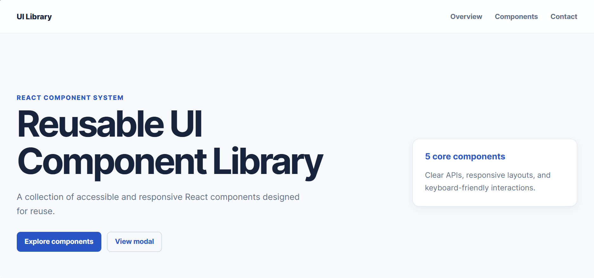
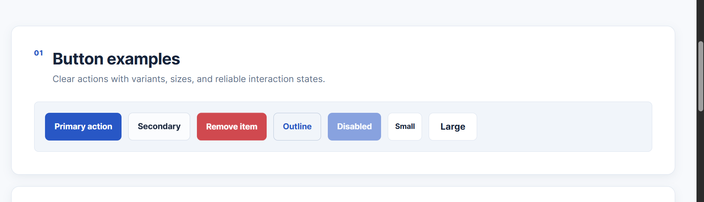
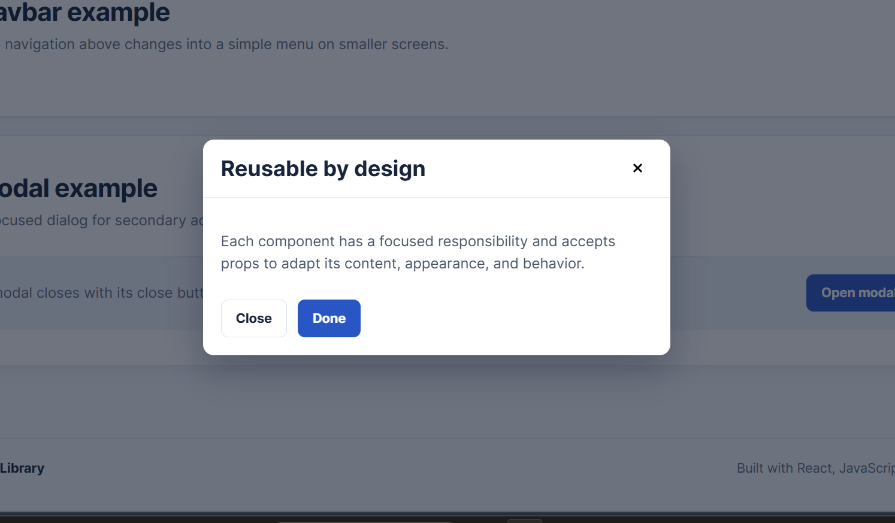
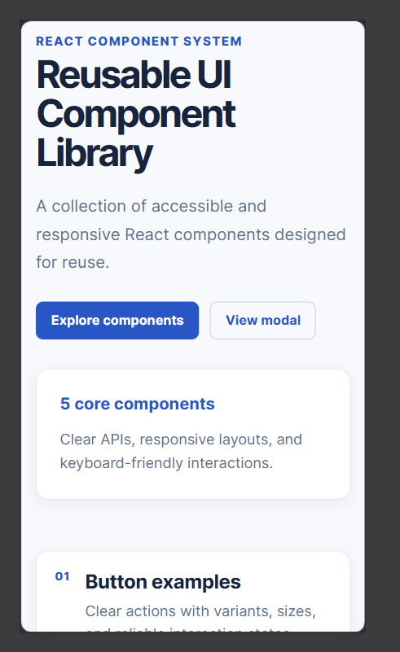
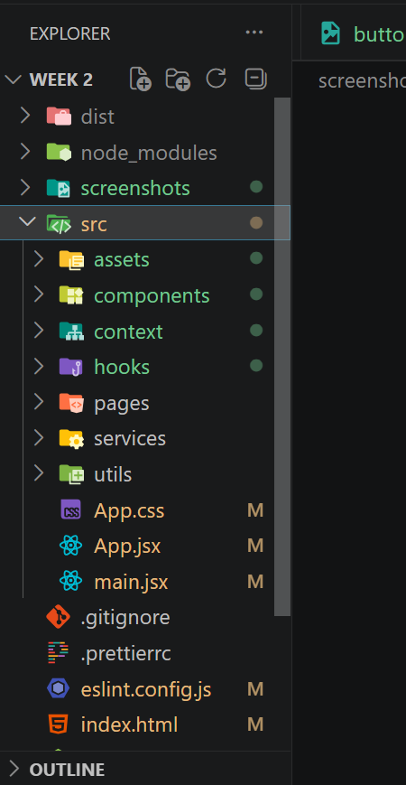
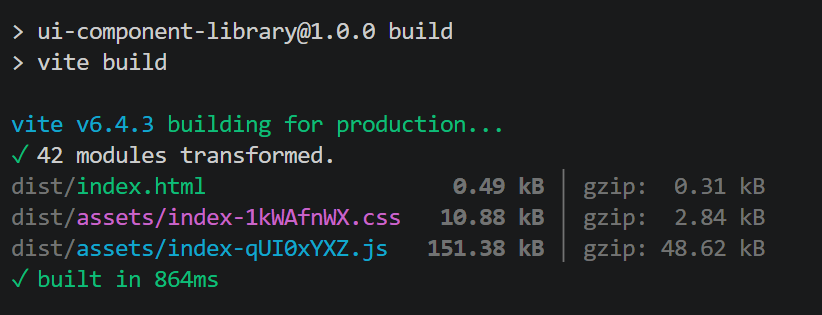
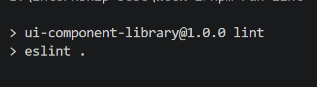

# Week 2 - Reusable UI Component Library

## 1. Introduction

This project is a small, reusable React component library presented through a documentation-style demo page. It demonstrates how well-scoped UI components can be reused with different content, visual variants, and actions.

## 2. Technologies Used

- **ReactJS** provides component structure and state management.
- **Vite** provides the development server and production build process.
- **JavaScript and JSX** define component behaviour and markup.
- **CSS** provides the design system, responsive layouts, and component states.

## 3. Component Architecture

Each component has its own folder containing a JSX file and CSS file. Keeping the behaviour and styles together makes the library easier to find, test, and extend.

```text
src/components/
├── Button/Button.jsx and Button.css
├── Card/Card.jsx and Card.css
├── Input/Input.jsx and Input.css
├── Navbar/Navbar.jsx and Navbar.css
└── Modal/Modal.jsx and Modal.css
```

The demo page in `App.jsx` composes these components with different props. Existing earlier-week project files remain available and are not removed.

## 4. Button Component

The Button component renders a real `button` element for actions. It accepts `children`, `onClick`, `type`, `disabled`, `variant`, and `size` props. Available variants are `primary`, `secondary`, `danger`, and `outline`; sizes are `small`, `medium`, and `large`.

```jsx
<Button variant="primary" size="medium" onClick={saveChanges}>
  Submit
</Button>
```

Its CSS uses shared variables and supplies hover, active, disabled, and visible keyboard-focus states. Using a native button provides correct keyboard interaction and disabled behaviour.

## 5. Card Component

Card displays reusable content using `title`, `description`, optional `image`, optional `badge`, `buttonText`, and `onButtonClick` props.

```jsx
<Card title="React Components" description="Reusable components built with React." badge="Core" buttonText="Learn more" />
```

An image is only rendered when supplied and receives meaningful alt text derived from the card title. The responsive grid on the demo page shows three card configurations.

## 6. Input Component

Input accepts `label`, `type`, `name`, `placeholder`, `value`, `onChange`, `required`, `error`, and `disabled`. The label is connected to the control with matching `htmlFor` and `id` values.

```jsx
<Input label="Email" type="email" name="email" value={email} onChange={handleChange} required error={errors.email} />
```

Errors use `aria-invalid`, `aria-describedby`, and an alert role so feedback is available beyond colour alone. The form demo validates name, email format, and password length without a third-party form library.

## 7. Navbar Component

Navbar receives a `logo` and an array of `{ label, href }` links. It uses semantic `header`, `nav`, list, link, and button elements. On mobile screens its toggle button opens a compact vertical link menu and exposes the state with `aria-expanded`.

## 8. Modal Component

Modal accepts `isOpen`, `onClose`, `title`, and `children`. It returns nothing while closed, uses dialog semantics when visible, focuses the close button on open, supports Escape, and lets users close by clicking the overlay.

```jsx
<Modal isOpen={isOpen} onClose={() => setIsOpen(false)} title="Example Modal">
  <p>This is modal content.</p>
</Modal>
```

## 9. Responsive Design and Accessibility

CSS media queries adapt the card grid, form layout, navigation, buttons, and modal for desktop, tablet, and mobile widths. The implementation uses semantic elements, native controls, keyboard-visible focus styles, associated labels, meaningful link text, and dialog accessibility attributes.

## 10. Running the Project

```bash
npm install
npm run dev
```

Use `npm run build` to create a production build and `npm run lint` to check code quality.

## 11. Testing

The components were tested in the browser at different screen sizes.

| Test | Viewport | Result |
|---|---|---|
| Desktop layout | 1440px | Passed |
| Tablet layout | 768px | Passed |
| Mobile layout | 375px | Passed |
| Button interaction | Browser | Passed |
| Form validation | Browser | Passed |
| Modal interaction | Browser | Passed |
| Production build | Vite | Passed |
| ESLint check | Local | Passed |

## 12. Evidence

### 12.1 Complete Component Library



### 12.2 Button Components



### 12.3 Form and Validation


### 12.4 Modal



### 12.5 Responsive Mobile View



### 12.6 Project Structure



### 12.7 Production Build



### 12.8 ESLint

